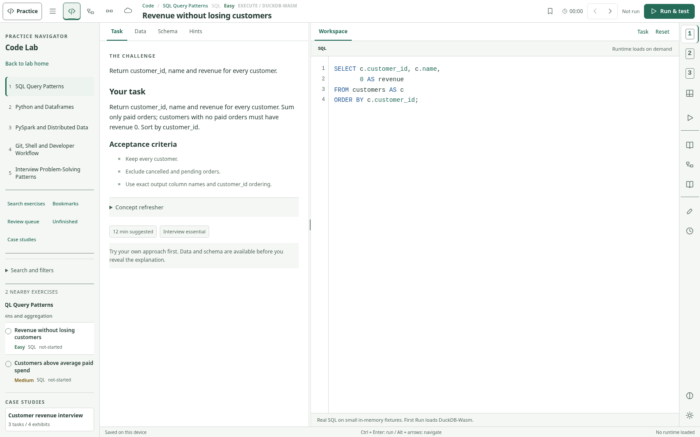

# CodeDELeet V2 - Interview Workstation

A local-first data engineering practice app: one resizable workstation, four labs, 51 exercises, 13 specialist renderer types. This is the **complete source release candidate**, not a patch or design mockup. `dist/` contains the built static site from this delivery.



## Start here

For the person publishing the new branch: read **[00_START_HERE.md](00_START_HERE.md)** and **[docs/NEXT_AI_HANDOFF.md](docs/NEXT_AI_HANDOFF.md)**. No GitHub or Netlify changes were made while producing this ZIP.

### Run the included build without npm dependencies

With Node.js 22 installed, from this folder:

```sh
node scripts/serve.mjs
```

Open `http://127.0.0.1:5173`. This serves the included `dist/`. Opening `index.html` through `file://` is not supported.

### Rebuild from source

```sh
npm ci --ignore-scripts
npm run check
npm run build
npm start
```

TypeScript **5.8.3** is the only npm build dependency and is pinned exactly. Node 22.16.0 / TypeScript 5.8.3 were used for this build. `package-lock.json` uses the exact tarball URL and integrity obtained from the npm registry. Cold dependency download was unavailable in this container; the build used the installed exact-version compiler. See `docs/BUILD_DEPENDENCY_PROVENANCE.json`.

### Test

```sh
npm test
python tests/fixture_check.py
python -m pip install -r requirements-dev.txt
python -m playwright install chromium
python tests/ui_smoke.py
# With npm start running in a second terminal, in a network-enabled environment:
python tests/network_runtime_smoke.py
```

`tests/ui_smoke.py` defaults to a documented in-memory **delivery harness** that renders the actual built JavaScript, CSS, CodeMirror and DOM. Set `UI_MODE=http` and optionally `BASE_URL` to test a served origin instead. Default executable discovery prefers `CHROMIUM_PATH`, then a system Chromium, then Playwright's downloaded Chromium.

## What is in V2

| Area | Implemented |
|---|---|
| Shared workstation | Search/filter library; fixed desktop height; keyboard/pointer pane resize; collapsible results drawer; focus mode; mobile tabs; previous/next; timer; local notes/bookmarks/confidence/history |
| Code | Bundled CodeMirror; DuckDB-Wasm adapter; disposable Pyodide worker; real result comparison when runtimes load; explicit cancellation and timeouts; PySpark schema/rows/plan review |
| Model / BI | Editable teaching-model relationships; fact grain; country/category filters; bounded DAX interpreter and visible-row/KPI feedback |
| Pipeline | Editable DAG/config/script; deterministic task states, retries, skip and selected trigger rules; ADF-style edge conditions; dbt manifest/run-results investigation |
| Systems / Cloud | Editable conceptual architecture, Mermaid source/optional renderer, supplied Spark task metrics, Terraform/OpenTofu plans, Kubernetes events/logs, Docker cache evidence |
| Git | Virtual repository state, commit DAG, HEAD/branches/tracking, index and working files, diff, merge, linear rebase, fetch, conflicts, reset/revert/stash and predictions |
| Terminal | Separate Bash text streams and PowerShell object pipelines over a virtual filesystem; no host terminal or network shell |
| Deepnote | Optional URL mapping/import-export; blank template examples; buttons remain hidden until the user configures real Deepnote URLs |

## Truthful execution boundaries

**Real execution adapters:** browser DuckDB SQL and browser Python, loaded only after explicit consent. **Important release gate:** their external downloads and worker startup could not be exercised here because the environment blocks browser URL navigation and external downloads. Adapter source is implemented; hosted runtime verification remains required before promoting the preview to production.

**Simulations / bounded checks:** Git, shell, DAG, DAX teaching subset and configuration checks. **Guided review:** PySpark, vendor SQL, architecture and supplied infrastructure/performance evidence. No Spark cluster, Power BI service, Airflow scheduler, dbt process, Kubernetes API, Terraform apply, cloud account or backend runner is provisioned.

SQL cases are small, public fixtures, not hidden secure interview grading. All answers ship to the browser. Only run code you trust; browser Python/JavaScript interoperability is not a hostile-code security boundary.

## State and deployment

V1's `data-practice-studio.v1` storage key, schema 1 and all 27 baseline exercise IDs are preserved. V2 adds fields and a one-time pre-upgrade snapshot. Export a backup **before switching domains**: a branch preview has a different localStorage origin. See [migration instructions](docs/MIGRATION_V1_TO_V2.md).

Netlify configuration: build `npm run build`, publish `dist`, Node 22. No functions, keys or environment secrets are needed. For a manual static deploy, use the **contents** of `dist/`. Do not upload the ZIP itself as a source file and expect GitHub to unpack it.

## Documentation

[Audit](docs/V2_AUDIT.md) | [Tests](docs/V2_TEST_REPORT.md) | [Known limits](docs/KNOWN_LIMITATIONS.md) | [V2.1 backlog](docs/V2_1_BACKLOG.md) | [Exercise inventory](docs/EXERCISE_INVENTORY.md) | [Renderer contracts](docs/RENDERER_INVENTORY.md) | [Deepnote](docs/DEEPNOTE_INTEGRATION.md) | [Git](docs/GIT_VISUAL_LAB.md) | [Terminal](docs/TERMINAL_LAB.md) | [Third-party notices](THIRD_PARTY_NOTICES.md)
