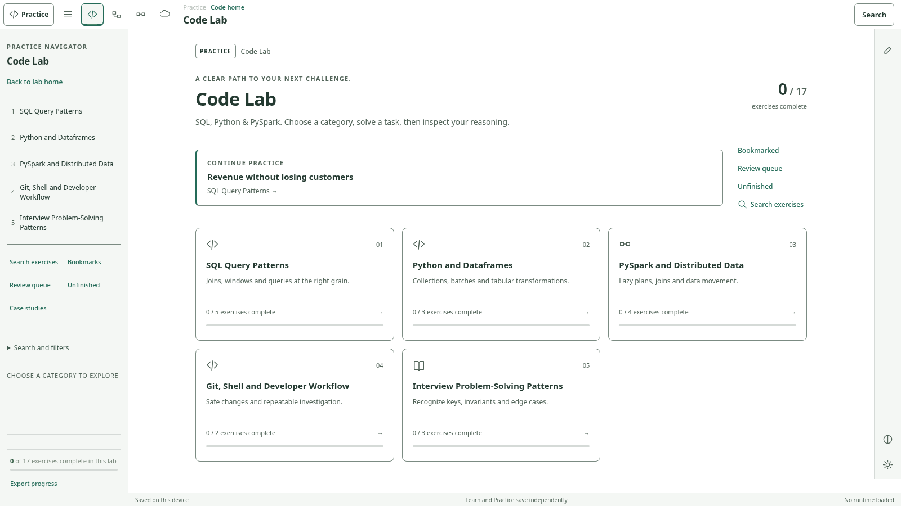
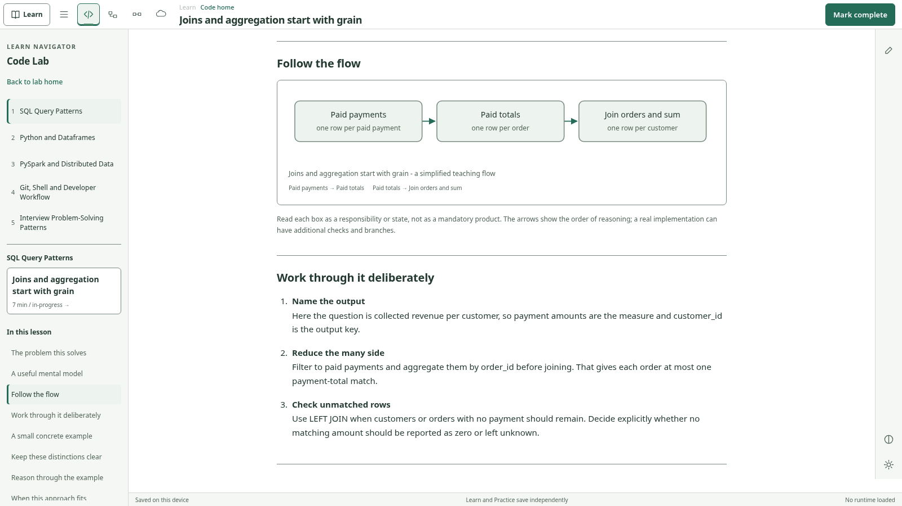

# CodeDELeet V2.4

A local-first data-engineering interview application with two app modes: Practice
and Learn. Four labs share the same compact shell, responsive navigator, right
rail and four existing themes. No backend runner, credentials or production cloud
connection is added.



## Learning and navigation

Each global lab icon opens a home, with exactly five primary categories. Category
pages show progress, an explicit next exercise where available, grouped discovery,
filters and related authored cases. Contextual navigation shows the current
category and nearby subgroup, not the whole exercise bank by default. Search,
bookmarks, review and unfinished queues remain available.

Learn contains 20 validated seed lessons: one per category, across SQL/Python/Spark,
modeling/DAX/BI, pipeline design and systems/cloud reasoning. Lessons combine
original diagrams, code, tables, worked examples, decisions, pitfalls, self-checks,
takeaways and honest links to existing Practice exercises. No dedicated Practice
exercise exists for BI serving yet; the category says so and offers its lesson
rather than inventing an exercise or changing an existing ID.



Practice completion and Learn completion are independent. Backups include both,
with timestamp-based merge and preservation of old backups, unknown safe future
lesson IDs and independent case answers. Lesson notes do not write into exercise
notes. UI themes remain the existing Sage Light, Fluent Light, Fluent Soft and
Slate Dark choices.

## Retained Practice workstation

All 51 existing exercises, four authored cases, 13 renderer contracts and twelve
layout presets remain. The desktop retains the single 52px header and 48px tool
rail. Header attempt controls, editor identity/undo, Focus restore, docked output,
graph editing, Git/terminal state and case isolation are regression-tested.

| Lab | Preset 1 | Preset 2 | Preset 3 |
|---|---|---|---|
| Code | Solve | Data & Debug | Case Study |
| Model / BI | Model Designer | Measures & Data | Case Study |
| Pipeline | Pipeline Designer | Run Investigator | Case Study |
| Systems / Cloud | Workbench | Compare & Diagnose | Case Study |

A Case Study **preset** does not start an authored case. A case is opened explicitly
from Case studies. Its task answers and exhibit cursor remain independent of
standalone answers. Returning from Learn can resume the current in-session case.

## Run

The delivery includes a complete prebuilt `dist/`:

```sh
node scripts/serve.mjs dist
```

To rebuild, install the pinned dependency and run the check/build pipeline:

```sh
npm ci --ignore-scripts
npm run check
npm test
```

`npm test` builds and validates the 20-lesson catalog, then runs all unit tests.
See [start here](00_START_HERE.md) for the full browser, fixture, clean-rebuild and
runtime commands. Static hosting remains `dist/`; no push, preview or deployment
was performed during this pass.

## Execution boundaries

SQL uses the unchanged DuckDB-Wasm adapter; Python/basic pandas uses the unchanged
Pyodide worker. Both download only after explicit use/consent. PySpark lessons are
conceptual and its Practice path remains guided review, not a browser Spark
cluster. DAX, DAG, Git, Bash/PowerShell and infrastructure checks remain bounded
teaching implementations. Mermaid remains pinned to 11.16.1 and loads on demand;
lesson diagrams use local SVG and do not require Mermaid or a CDN.

Deepnote remains links-only with explicit safe URL validation. No private notebook
archive or handoff reference artwork is shipped. Lessons link to official further
reading and avoid claiming a live connection to a cloud product.

## Evidence and provenance

[Implementation](docs/V24_IMPLEMENTATION_REPORT.md) |
[Test results and blocked gates](docs/V24_TEST_REPORT.md) |
[Routing/state contract](docs/V24_STATE_AND_ROUTING.md) |
[Original browser screenshots](evidence/v24/gallery.html) |
[Measured layout JSON](evidence/v24/V24_LAYOUT_METRICS.json) |
[Next integration gate](docs/NEXT_AI_HANDOFF.md)

The supplied ZIP declares upstream base `v2.3-manual-upload-clean` at
`a4aad2e4ad5fe3163c5ad725456ea7e84df28964`. It did not contain Git history, so that
upstream object is not independently verified. A local baseline was committed
before edits, and implementation used local branch `v2.4-learning-navigation-pro`.
Earlier V2/V2.2/V2.3 documents are historical; the V2.4 report is authoritative for
this delivery. Application code is MIT; see [third-party notices](THIRD_PARTY_NOTICES.md).
