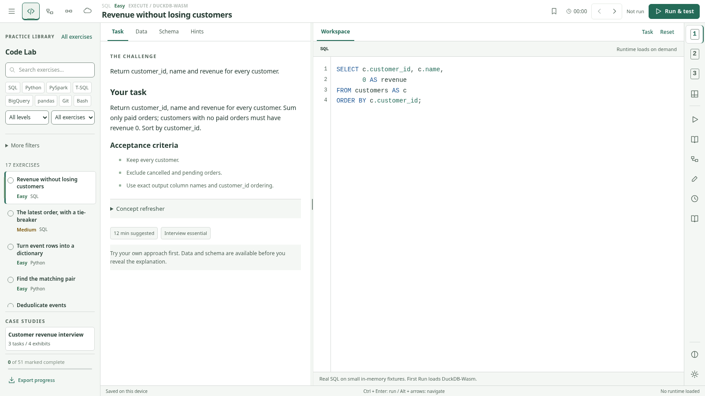

# CodeDELeet V2.3

A local-first data-engineering interview workstation. Four labs, twelve compositional layout presets, 51 preserved exercises, four authored case studies, and bounded specialist teaching engines. No credentials, backend execution service, or production cloud connection.



## Compact-shell update

V2.3 collapses the previous two desktop chrome rows into one 52px header. Four
neutral lab icons replace routine wordmark/version branding. Bookmark, timer,
previous/next, execution boundary and the primary action remain visible. The right
rail owns layout modes 1/2/3, Focus and the new four-choice Theme panel.

Measured workstation height increases by **82.5px at 1600x900**, **81.25px at
1366x768**, **80px at 1024x768**, and **44px at 390x844** using the supplied V2.2
baseline and the same viewports/DPR. Normal text sizes and graph fixtures are not
reduced. See [full measured boxes](evidence/v23/V23_LAYOUT_METRICS.json).

No learning engine, content bank, editor implementation, worker or runtime version
is replaced. The following V2.2 architecture and learning contracts are retained.

## Retained workstation

The shared shell has a compact lab navigator, per-lab quick filters, three presets per lab, a 48px tool rail, temporary Focus, four themes, and independently docked output. Layout changes retain the actual CodeMirror document and undo history. Output remains independent of Notes, Explanation and References; stale attempts are visibly marked after inputs change.

| Lab | Preset 1 | Preset 2 | Preset 3 |
|---|---|---|---|
| Code | Solve | Data & Debug | Case Study |
| Model / BI | Model Designer | Measures & Data | Case Study |
| Pipeline | Pipeline Designer | Run Investigator | Case Study |
| Systems / Cloud | Workbench | Compare & Diagnose | Case Study |

Choosing a Case Study **preset** does not start an authored case. Open an authored case explicitly from the navigator. Its exhibit pages and task navigation are independent. Case answers never silently overwrite standalone answers; explicit copying creates a recoverable checkpoint.

## Run and build

```sh
npm ci --ignore-scripts
npm run check
npm run build
node scripts/serve.mjs dist
```

The prebuilt `dist/` needs only static file hosting. Build configuration remains `npm run build`, publish `dist`. No deploy was performed. Keep production untouched until the coordinator completes the promotion gate.

## Test

```sh
npm test
python tests/fixture_check.py
python tests/ui_smoke.py
python tests/v22_ui.py
python tests/v23_ui.py
python tests/v23_layout.py
python -m unittest discover -s tests -p test_hosted_verifier.py
# Start the static server in another terminal before these:
python scripts/validate_release.py
python tests/network_runtime_smoke.py
```

Install `requirements-dev.txt` and Playwright Chromium for browser tests. The deterministic UI harness loads the actual compiled modules, bundled editor, CSS and fixture data into Chromium; it substitutes file transport and browser storage. It does **not** substitute SQL/Python execution. The separate network test requires a real navigable HTTP origin and external runtime downloads.

## Execution boundaries

SQL uses the real DuckDB-Wasm adapter. Python/basic pandas uses the real Pyodide worker. Both load only on explicit use. PySpark is guided review, not an in-browser Spark cluster. DAX, DAG, Git, Bash/PowerShell and infrastructure checks are explicitly limited teaching implementations or supplied evidence. Mermaid is pinned to 11.16.1, loaded on demand; offline SVG canvases remain available.

Deepnote is links-only, with safe explicit URL validation and optional public preview metadata. No private notebook archive is shipped publicly. App previews are not editable notebooks.

## Documentation and evidence

[Start here](00_START_HERE.md) · [V2.3 implementation](docs/V23_IMPLEMENTATION_REPORT.md) · [V2.3 test report](docs/V23_TEST_REPORT.md) · [Known limitations](docs/KNOWN_LIMITATIONS.md) · [Coordinator handoff](docs/NEXT_AI_HANDOFF.md) · [Architecture](docs/V2_2_ARCHITECTURE.md) · [Screenshot gallery](evidence/v23/gallery.html)

V2 and V2.2 reports under `docs/` and `evidence/v22/` are retained historical evidence, not current V2.3 test or deployment claims. Use `docs/V23_TEST_REPORT.md` and `evidence/v23/` for this pass. Synthetic fixtures and original teaching content remain in the built-in bank. Application code is MIT; see [third-party notices](THIRD_PARTY_NOTICES.md) and [security boundaries](SECURITY.md).
