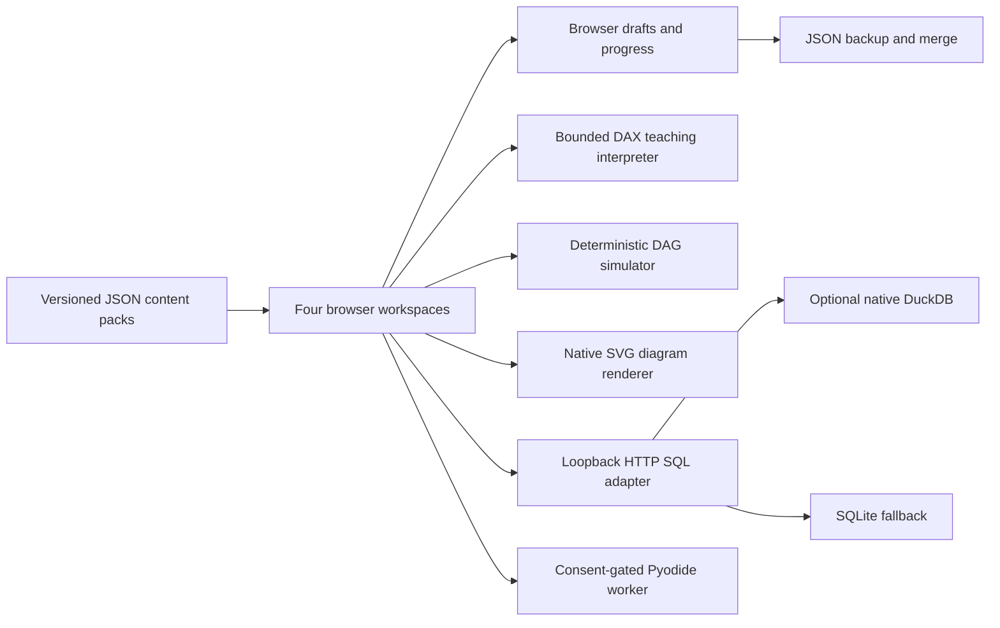

# Architecture and execution contracts - v0.1

## Decision

Four specialized workspaces share questions, learning content, navigation, drafts, import/export and progress. The application is not a universal engine emulator. Its common currency is an exercise with an explicit execution mode.

The original browser implementation is strict TypeScript compiled to small ES modules, with no runtime framework or editor dependency. This keeps the initial app usable from committed files and enables a single-file edition. React/Vite were not necessary for the requested first version; this is not a transplanted legacy monolith. Typed rendering/controller boundaries allow later replacement of the view layer without renaming questions or rewriting the exercise bank.

The drawing documents implemented boundaries. The Python adapter is optional and its remote loading path remains unvalidated in this environment. All links to official product docs are references, not live integrations.

## Modules

`types.ts` defines the versioned pack, question, draft, graph and query result types. `core.ts` handles safe identifiers, structural validation, pack ownership/version checks, copy/merge logic and persistence. `ui.ts` renders escaped HTML. `app.ts` controls routes, input, simulation/execution, dialogs, imports and downloads. `graph.ts` owns topology, templates, layout, SVG, DSL and simulations. `dax.ts` is a tokenizer, parser and interpreter over supplied BI rows. `runtime.ts` separates HTTP SQL from browser Python.

The browser's teaching datasets are intentionally tiny and public. `fixtures.json` has a SQL customers/orders dataset and an independent BI DimCustomer/DimProduct/Sales dataset. They are not a shared production ledger. BI revenue 410 is not the paid-order SQL answer.

## SQL contract

A POST to `/api/sql` supplies code, questionId and a tests flag. Only same-origin local requests are accepted. Each worker reads the repository fixture and returns actual columns, values, engine identity, elapsed time and truncation status. A trusted server-registered question may add output-based checks on three fixture variants. Row order matters when specified; duplicate multiplicity and output column names matter. Floating numeric comparison rounds to seven decimals; it is not an exact arbitrary-precision financial checker.

Custom browser packs can run SQL against the shared fixture, but they cannot register trusted expected answers or server tests. A custom query's result is explicitly not a certified passing answer. Server test registration is currently in `server/app.py` and built-in `starter.json`; a pluggable server fixture/test registry is future work.

SQLite syntax is not T-SQL, BigQuery SQL or DuckDB syntax. T-SQL/BigQuery exercises use review mode instead of claiming dialect compatibility. There is no transparent Spark-to-DuckDB translation.

## BI contract

The starter model is fixed: two dimensions filter an order-line fact. Card positions and relationship active state are editable; arbitrary entities, cardinality or field schemas are not authorable in this release. Filters affect the visible fact rows through active dimension-to-fact relationships. Model checks inspect chosen grain, key uniqueness/non-nullness, active relationships and foreign-key membership on the toy fixture.

The KPI preview is backed by a real local calculation on that fixture, not random values. DAX syntax supported: SUM, SUMX, COUNTROWS, DISTINCTCOUNT, DIVIDE, simple arithmetic, CALCULATE with Country/Category string-equality filters, and the provided Revenue/Cost/Gross Profit references. Table/column lookup is case-insensitive. Empty aggregate rows return BLANK represented by null. CALCULATE replaces a filter on the same supported column while preserving the other slicer. Unsupported syntax throws an explicit subset error.

This is not full DAX semantics: no context transition, KEEPFILTERS, ALL, FILTER, time intelligence, expanded tables, bidirectional relationships, inactive-relationship activation, arbitrary measures, variant types, locale grammar, security filters or VertiPaq. Case behavior for text values is ordinary JavaScript equality, not a complete Tabular collation implementation. Measures inside SUMX and CALCULATE inside row context are rejected rather than misleadingly approximated. Direct division by zero errors and suggests DIVIDE. A valid Microsoft DAX expression can be unsupported here.

C# scripts are editable/exportable reference text. No .NET, Tabular Object Model, XMLA endpoint or Power BI Desktop is embedded. Tool workspaces were inspired by model/editor/inspector workflows rather than copying desktop code.

## Pipeline contract

Graph edits, not code text, are the simulator input. Task IDs and active directed edges define dependencies. Kahn topological ordering rejects cycles. Tasks start after all parent tasks finish successfully. A configured transient failure fails once; one or more allowed retries produces one retry and success. Downstream tasks blocked by a failed parent are labeled upstream_failed. Durations use invented ticks, not wall time.

Only a basic all-success rule is modeled. No real scheduler, queue, executor, sensor, catchup, backfill, task mapping, dbt compilation, ADF integration runtime or data movement exists. The intentionally flawed starter bypasses a quality gate so repairing the diagram has a visible effect. Replay/idempotency and watermark correctness still require reasoning review; a connected graph does not prove them.

## Architecture and diagrams

The same graph model renders original native SVG. A small line-based DSL accepts `source[Label] -> target[Label]`; no arbitrary code, libraries or cloud calls are involved. Nodes can be selected/dragged; architecture labels and roles can be edited; edges/nodes can be added/removed. Applying script keeps positions for stable node IDs. Limits: 40 nodes, 100 edges, 15,000 script characters. The language is intentionally not full Mermaid. It exports valid simple Mermaid and standalone SVG; it does not import arbitrary Mermaid or cloud templates.

Structure checks cover cycles, expected roles and source-to-sink reachability. They do not establish product compatibility, security, cost, latency, resilience or deployability. Some conceptually valid cyclic event architectures are outside this acyclic teaching canvas.

The Spark illustration uses a documented unitless formula: evenly distributed work plus one skewed partition, an illustrative broadcast multiplier, and a fixed per-task overhead. It helps compare assumptions. It cannot estimate real stage duration, optimal partitions or cluster size. There is no Spark cluster, Spark Connect server or live monitoring dashboard.

## Storage formats and external runtimes

DuckDB is the optional local query engine. DuckDB-Wasm is a possible future browser-only adapter, not implemented now. MotherDuck is not connected. Iceberg and DuckLake are conceptual exercises, not simulated transaction catalogs or file-format implementations. JSON fixtures do not provide snapshot isolation or table-format semantics.

Spark practice can be exported as code to a separately configured environment. Colab, Deepnote and Databricks are not embedded, authenticated or connected. Spark Connect requires a real server; an iframe does not supply compute or a free cluster. No free-tier assumption is required for this app.

Official design references, consulted for boundaries:
- DuckDB clients and configuration: https://duckdb.org/docs/stable/clients/python/overview and https://duckdb.org/docs/stable/configuration/overview
- DuckDB-Wasm: https://duckdb.org/docs/stable/clients/wasm/overview
- Power BI star schema: https://learn.microsoft.com/en-us/power-bi/guidance/star-schema
- Spark Connect: https://spark.apache.org/docs/latest/spark-connect-overview.html
- Deepnote Spark: https://deepnote.com/docs/spark
- DuckLake specification: https://ducklake.select/docs/stable/specification/introduction
- Apache Iceberg reliability: https://iceberg.apache.org/docs/latest/reliability/

These are official external references, not bundled engines or guarantees about free-tier availability. Version/access terms can change.
